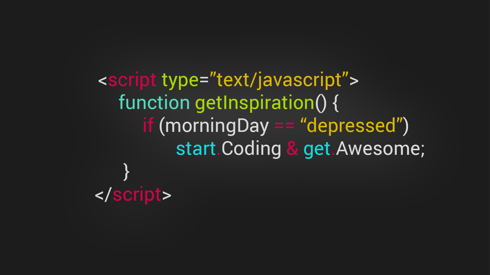

  
  <h1>Hi 👋, I'm Areeba Memon</h1>
 <h3>A passionate Front-End Developer & Microsoft Learn Student Ambassador from Sindh, Pakistan 🇵🇰</h3>

🌱 I’m currently learning Backend.  
📝 I sometimes write articles and blogs on [Medium](https://medium.com/@mareeba166/introduction-of-software-development-b0b028d22540).  
📫 How to reach me: mareeba166@gmail.com  
⚡ Fun fact: I bring calm vibes to code, and chaos to bugs! 😉

## 🧑‍💻 Connect with me:
  
  

## 🛠️ Languages and Tools:

## ⚡ GitHub Stats

    
    
  

> “Code with purpose, design with passion, and never stop growing.” 🌱
